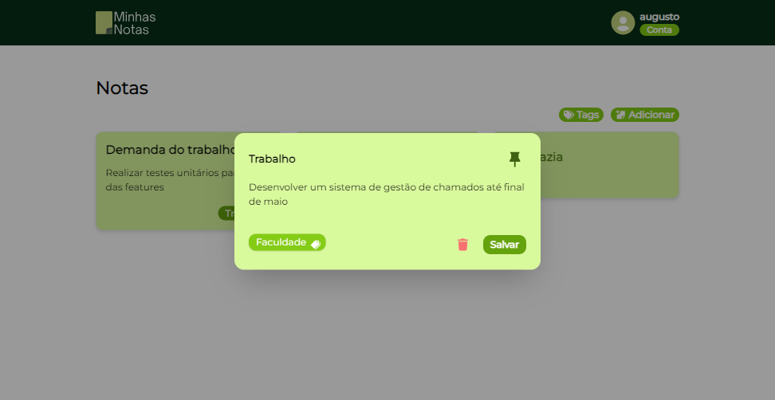
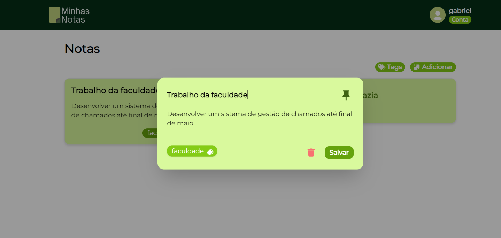

#   Minhas notas

Apesar da evolução tecnológica, muitas pessoas ainda enfrentam dificuldades na organização e gerenciamento de suas notas e ideias. 

Embora existam inúmeras soluções digitais disponíveis, desde aplicativos simples até softwares mais complexos, ainda há desafios em encontrar uma ferramenta que seja verdadeiramente eficiente e acessível para todos os usuários.

Para testa o Minhas Notas, clique [aqui](https://minhas-notas-br.vercel.app).


##### **IMPORTANTE!**

> Talvez ao tentar acessar Minhas notas, possa demorar um pouco para que a página carregue e mostre as notas. Isso ocorre devido a API do projeto está hospedada no [Render](https://render.com), mas não se preocupe que dentro de um minuto a página carregará normalmente e as publicações serão mostradas.

## 🎨 **Layout**

<div style="display: flex; gap: 10px;">
    
    
</div>

## ⚙️ Sobre o projeto

O minhas notas é uma aplicação desenvolvida para fortalecer a organização de ideias. Focamos em oferecer uma plataforma intuitiva e eficiente para os usuários registrarem e gerenciarem suas ideias de forma clara e organizada. 

Com recursos inovadores de organização e a capacidade de adicionar tags às notas, facilitamos o processo de anotação e garantimos acesso seguro. Este projeto foi desenvolvido utilizando React.

Cique [aqui](https://github.com/gabriel-augg/minhas-notas-api) para saber mais informações sobre a API do projeto.

## 💻 Tecnologias

- JavaScript
- React 18.2.0
- Axios 1.6.8
- Toastify 10.0.5
- React-icons 5.1.0
- TailwindCSS 3.4.3
- DaisyUI 4.10.2
- React-hook-form 7.51.3
- Zod 3.22.5

## 🚀 Getting started

Para rodar a aplicação localmente, é necessério fazer clone do projeto e instalar todas as suas dependências.

### Requisitos

- Git
- Node
- NPM
- MySQL

### Clonando o repositório e instalando as dependências

Para clonar o repositório, execute o seguinte comando na pasta de desejo:

```bash
git clone https://github.com/gabriel-augg/minhas-notas
```

Apos clonar o repositório, para instalar as dependências, execute os seguintes comandos:


```bash
cd minhas-notas
npm install
```

## Iniciando o projeto

Após a instalação de todas as dependência, execute o seguinte comando no terminal:

```bash
npm run dev
```